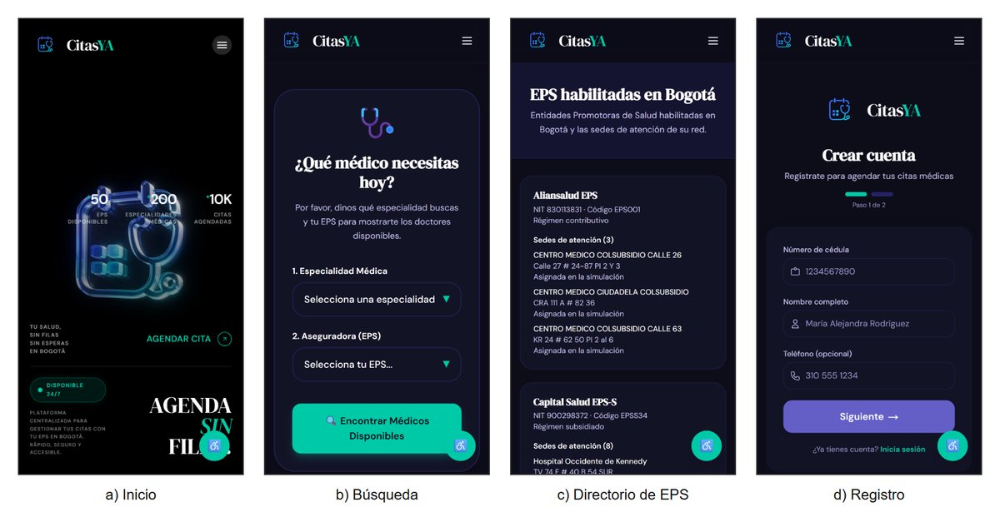
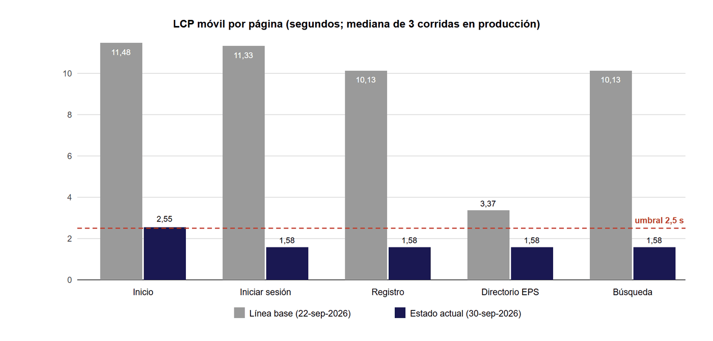
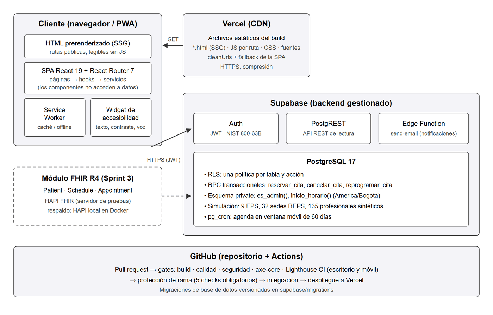
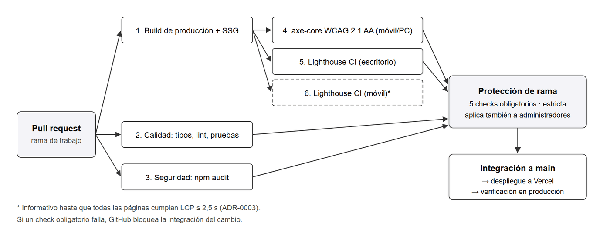

<div align="center">

# CitasYA 🩺

**Agenda tu cita médica en Bogotá, sin filas ni esperas telefónicas.**
Aplicación web progresiva (PWA) accesible para consultar y agendar citas con tu EPS, diseñada con las personas mayores como usuario principal.

[](https://github.com/alteuz/citasya/actions/workflows/ci.yml)
[](https://citasya-seven.vercel.app)
[](https://www.w3.org/TR/WCAG21/)
[](tsconfig.app.json)
[](package.json)

[**Ver la aplicación**](https://citasya-seven.vercel.app) · [Decisiones de arquitectura](docs/adr) · [Pipeline de calidad](.github/workflows/ci.yml)



</div>

---

## ¿Qué es CitasYA?

En Colombia, conseguir una cita médica suele implicar líneas telefónicas saturadas, portales distintos para cada EPS y páginas difíciles de usar para quien ve mal o tiene poca experiencia digital. CitasYA reúne en una sola aplicación, instalable en el celular, la búsqueda de profesionales por especialidad y EPS, el agendamiento, la reprogramación y la cancelación de citas.

El proyecto es el **trabajo de grado de Ingeniería de Sistemas en UNIMINUTO (Bogotá)**. Se apoya en tres pilares:

| Pilar | Qué significa en este repositorio |
|---|---|
| ♿ **Accesibilidad verificable** | WCAG 2.1 AA comprobado automáticamente en cada cambio. Si un pull request introduce una violación, no se puede integrar. |
| ⚡ **Arquitectura PWA / JAMstack** | Las páginas públicas llegan ya renderizadas desde la CDN (SSG); los datos vienen de APIs gestionadas. |
| 🔗 **Interoperabilidad HL7 FHIR R4** | El contrato de datos Patient / Schedule / Appointment contra HAPI FHIR está en desarrollo (Sprint 3). |

## Funcionalidades

- **Registro e inicio de sesión** con contraseñas según NIST SP 800-63B y verificación contra contraseñas filtradas (k-anonimato).
- **Búsqueda** de profesionales por especialidad y EPS.
- **Agendamiento, reprogramación y cancelación transaccionales**: dos personas nunca obtienen la misma franja.
- **Mis citas e historial.**
- **Directorio de las EPS habilitadas en Bogotá**, con sus sedes reales del REPS y la procedencia de cada dato.
- **Panel de administración** de profesionales, disponibilidad y citas.
- **Notificaciones por correo** de confirmación, cancelación y reprogramación.
- **Widget de accesibilidad**: tamaño de texto, alto contraste, reducción de movimiento, guía de lectura y lectura por voz.
- **PWA instalable**, con Service Worker.

## Resultados medidos

Medición reproducible contra producción con Lighthouse 12.8 (3 corridas por página, mediana) y axe-core 4.11. Se compara la línea base del 22-sep-2026 con el estado al 30-sep-2026.

| Métrica (peor página) | Antes | Ahora | Meta |
|---|:---:|:---:|:---:|
| Violaciones WCAG 2.1 A/AA críticas o serias (axe-core) | 2 | **0** | 0 |
| Violaciones axe de cualquier tipo | 9 | **0** | — |
| Lighthouse Accesibilidad (móvil / escritorio) | 91 / 91 | **100 / 100** | ≥ 98 |
| Lighthouse Rendimiento (móvil / escritorio) | 67 / 90 | **96 / 100** | ≥ 85 / ≥ 95 |
| LCP móvil | 11,48 s | **2,55 s** (inicio) · 1,58 s (resto) | ≤ 2,5 s |
| Vulnerabilidades altas en producción | 6 | **0** | 0 |

<p align="center"></p>

> [!NOTE]
> La página de inicio todavía supera el LCP por 0,05 s, porque su encabezado con video aún no se prerenderiza. Por eso el check de **Lighthouse móvil** es informativo y no bloqueante. Cuando la página cumpla, pasará a ser obligatorio (ver [ADR-0003](docs/adr/0003-adopcion-progresiva-de-gates.md)).

Cada optimización se validó con un experimento A/B, incluido un resultado negativo que quedó documentado: diferir el cliente de Supabase redujo el JavaScript un 34 %, pero no el LCP. Ver [ADR-0006](docs/adr/0006-prerenderizado-estatico-rutas-publicas.md).

## Arquitectura

<p align="center"></p>

- **Frontend:**
  - SPA con React 19 y React Router 7 (carga diferida por ruta).
  - Las rutas públicas se **prerenderizan durante el build** (`vite build --ssr` y `react-dom/server`) y React las **hidrata** en el navegador.
  - Los componentes nunca acceden a la base de datos: todo pasa por `src/services`.
- **Backend (Supabase):**
  - PostgreSQL 17 con **RLS por tabla y por acción**.
  - Funciones transaccionales `reservar_cita`, `cancelar_cita` y `reprogramar_cita`, con `SELECT … FOR UPDATE`, un índice único parcial y errores tipados.
  - Agenda en ventana móvil de 60 días mantenida por `pg_cron`.
- **Entrega:** archivos estáticos en la CDN de Vercel.

## Calidad como gates de CI

<p align="center"></p>

| Gate | Verifica | Obligatorio |
|---|---|:---:|
| Build de producción | TypeScript, build de Vite y prerenderizado | ✅ |
| Calidad | Tipos estrictos, ESLint (con `jsx-a11y`) y pruebas unitarias | ✅ |
| Seguridad | `npm audit` sin vulnerabilidades altas ni críticas en producción | ✅ |
| Accesibilidad | axe-core en Chromium real, móvil (Pixel 7) y escritorio, más pruebas de hidratación | ✅ |
| Lighthouse CI (escritorio) | Accesibilidad ≥ 98, rendimiento ≥ 95, LCP ≤ 2,5 s | ✅ |
| Lighthouse CI (móvil) | Accesibilidad ≥ 98, rendimiento ≥ 85, LCP ≤ 2,5 s | Informativo |

La rama `main` está protegida: exige los 5 checks obligatorios, la rama al día y conversaciones resueltas. La regla también aplica a los administradores.

## Datos: simulación con fuentes reales

Las **entidades son reales y públicas**; las **personas son sintéticas**, para no tratar datos personales (Ley 1581 de 2012).

| Dato | Fuente |
|---|---|
| 9 EPS habilitadas en Bogotá | Ministerio de Salud (listado del 05-jun-2025) y Decreto 0182 de 2026 |
| 32 sedes de atención | [REPS — Datos Abiertos Colombia](https://www.datos.gov.co/) (`c36g-9fc2`), corte del 12-mar-2026 |
| Tiempos máximos por especialidad | Circular Externa 038 de 2025 (MGTE) |
| 135 profesionales y su agenda | Generados de forma determinista (`scripts/simulacion`, semilla `20260926`) |

## Empezar

**Requisitos:** Node.js 22 o superior y un proyecto de [Supabase](https://supabase.com).

```bash
git clone https://github.com/alteuz/citasya.git
cd citasya
npm install
cp .env.example .env   # completa VITE_SUPABASE_URL y VITE_SUPABASE_ANON_KEY
npm run dev
```

La base de datos se crea con las migraciones versionadas de [`supabase/migrations`](supabase/migrations) (`npx supabase db push`).

| Variable | Descripción |
|---|---|
| `VITE_SUPABASE_URL` | URL del proyecto de Supabase |
| `VITE_SUPABASE_ANON_KEY` | Clave pública (*publishable*) de Supabase |

## Scripts

| Comando | Qué hace |
|---|---|
| `npm run dev` | Servidor de desarrollo |
| `npm run build` | Build de producción con prerenderizado de las rutas públicas |
| `npm run serve:dist` | Sirve `dist/` igual que en CI (gzip y reescrituras de `serve.json`) |
| `npm run verify` | Tipos, lint, pruebas unitarias y build, en un solo paso |
| `npm test` · `npm run test:coverage` | Pruebas unitarias (Vitest), con cobertura opcional |
| `npm run test:e2e` | Pruebas end-to-end y de accesibilidad (Playwright + axe-core) |
| `npm run lhci` | Lighthouse CI local |
| `npm run audit:deps` | Auditoría de dependencias de producción |

## Pruebas

- **Unitarias:** 34, con Vitest.
- **End-to-end:** 28, con Playwright en móvil y escritorio. Incluyen axe-core y verifican que las páginas prerenderizadas se vean sin JavaScript y se hidraten sin errores.
- **Reglas de agendamiento en la base de datos:** 13, en [`supabase/tests/reglas_agendamiento.sql`](supabase/tests/reglas_agendamiento.sql). Corren dentro de una transacción que siempre se revierte.

## Estructura

```
├── src/
│   ├── pages/        # Vistas por ruta
│   ├── components/   # Componentes de interfaz y de diseño
│   ├── hooks/        # Sesión y consultas (useAuth, useServiceQuery)
│   ├── services/     # Único punto de acceso a datos; errores tipados
│   ├── lib/          # Cliente de Supabase diferido, contraseñas, entorno
│   ├── rutas.tsx     # Definición única de rutas (navegador y SSG)
│   └── prerender.tsx # Prerenderizado estático de las rutas públicas
├── supabase/         # Migraciones, pruebas de reglas y datos REPS
├── e2e/              # Pruebas Playwright (accesibilidad y prerenderizado)
├── scripts/          # Prerenderizado y generación de la simulación
├── docs/adr/         # Registros de decisiones de arquitectura
└── .github/          # Pipeline de CI y Dependabot
```

## Decisiones de arquitectura

| ADR | Decisión |
|---|---|
| [0001](docs/adr/0001-mantener-vite-spa.md) | Mantener Vite en lugar de migrar a Next.js |
| [0002](docs/adr/0002-quality-gates-en-ci.md) | Calidad como gates automáticos en CI |
| [0003](docs/adr/0003-adopcion-progresiva-de-gates.md) | Adopción progresiva: medir → corregir → bloquear |
| [0004](docs/adr/0004-tokens-de-color-semanticos.md) | Tokens de color semánticos |
| [0005](docs/adr/0005-simulacion-realista-y-agendamiento-robusto.md) | Simulación con datos reales y agendamiento transaccional |
| [0006](docs/adr/0006-prerenderizado-estatico-rutas-publicas.md) | Prerenderizado estático de las rutas públicas |

## Hoja de ruta

- [x] **Sprint 1 — Optimizar.** Accesibilidad, rendimiento, seguridad, gates de CI y simulación con datos reales.
- [ ] **Sprint 2 — Validar.** Pruebas de usabilidad (SUS) con personas de 60 años o más.
- [ ] **Sprint 3 — Integrar.** Interoperabilidad HL7 FHIR R4 (Patient, Schedule, Appointment) con HAPI FHIR.
- [ ] **Sprint 4 — Evaluar.** Comparativo final frente a la hipótesis del proyecto.

## Proyecto académico

Trabajo de grado del programa de Ingeniería de Sistemas, Corporación Universitaria Minuto de Dios (**UNIMINUTO**), Bogotá, 2026.

- **Autor:** Alejandro Agudelo Quintero.
- **Directora:** Prof. Maribel Medina Linares.

Los profesionales, pacientes y citas que aparecen en la aplicación son **datos simulados**: ninguna cita llega a una EPS real.
