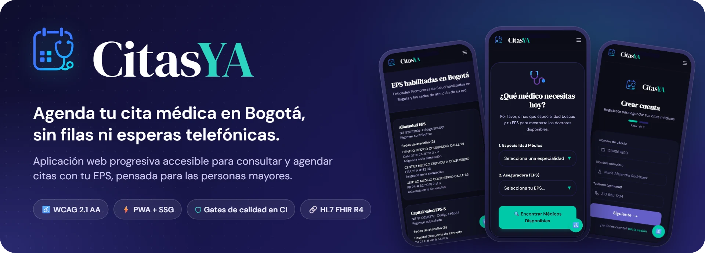
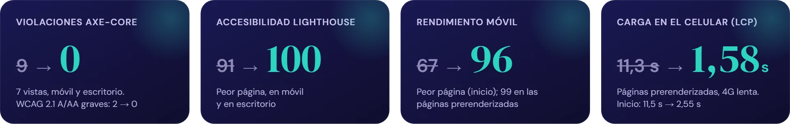

<p align="center">
  <a href="https://citasya-seven.vercel.app">
    
  </a>
</p>

<p align="center">
  <a href="https://citasya-seven.vercel.app"></a>
  <a href="https://www.w3.org/TR/WCAG21/"></a>
  <a href="#-resultados"></a>
  <a href="tsconfig.app.json"></a>
  <a href="#-proyecto-académico"></a>
</p>

<p align="center">
  <a href="https://citasya-seven.vercel.app"><b>Probar la aplicación</b></a> ·
  <a href="#-resultados">Resultados</a> ·
  <a href="#️-arquitectura">Arquitectura</a> ·
  <a href="#️-calidad-como-gates-de-ci">Gates de CI</a> ·
  <a href="#-empezar">Empezar</a> ·
  <a href="docs/adr">Decisiones (ADR)</a>
</p>

<br>

## 💡 Por qué CitasYA

En Colombia, pedir una cita médica suele implicar líneas telefónicas saturadas, un portal distinto para cada EPS y páginas difíciles de usar para quien ve mal o tiene poca experiencia digital. **CitasYA reúne en una sola aplicación, instalable en el celular, la búsqueda, el agendamiento, la reprogramación y la cancelación de citas**, y la diseña primero para las personas mayores.

<table>
  <tr>
    <td width="33%" valign="top">
      <h3>♿ Accesible por contrato</h3>
      WCAG 2.1 AA verificado por máquina en cada cambio. Si un pull request introduce una violación, GitHub no permite integrarlo.
    </td>
    <td width="33%" valign="top">
      <h3>⚡ Rápida en cualquier celular</h3>
      Las páginas públicas llegan ya renderizadas desde la CDN (SSG): el texto se ve sin esperar al JavaScript, incluso con 4G lenta.
    </td>
    <td width="33%" valign="top">
      <h3>🔗 Lista para interoperar</h3>
      Contrato de datos HL7 FHIR R4 (Patient, Schedule, Appointment) contra HAPI FHIR, en desarrollo en el Sprint 3.
    </td>
  </tr>
</table>

## 📊 Resultados

<p align="center">
  
</p>

<p align="center"><sub>Medición reproducible contra producción: Lighthouse 12.8 (3 corridas por página, mediana) y axe-core 4.11. Línea base del 22-sep-2026 frente al estado del 30-sep-2026.</sub></p>

> [!NOTE]
> La página de inicio todavía supera el LCP por 0,05 s (2,55 s frente a 2,5 s), porque su encabezado con video aún no se prerenderiza. Por eso el check de Lighthouse móvil es informativo. Cuando la página cumpla, pasará a ser obligatorio ([ADR-0003](docs/adr/0003-adopcion-progresiva-de-gates.md)).

<details>
<summary><b>Ver la tabla completa y el gráfico por página</b></summary>
<br>

| Métrica (peor página) | Antes | Ahora | Meta |
|---|:---:|:---:|:---:|
| Violaciones WCAG 2.1 A/AA críticas o serias | 2 | **0** | 0 |
| Violaciones axe de cualquier tipo | 9 | **0** | — |
| Lighthouse Accesibilidad (móvil / escritorio) | 91 / 91 | **100 / 100** | ≥ 98 |
| Lighthouse Rendimiento (móvil / escritorio) | 67 / 90 | **96 / 100** | ≥ 85 / ≥ 95 |
| LCP móvil | 11,48 s | **2,55 s** (inicio) · **1,58 s** (resto) | ≤ 2,5 s |
| Vulnerabilidades altas en producción | 6 | **0** | 0 |

<p align="center"></p>

Cada optimización se validó con un experimento A/B, incluido un resultado negativo documentado: diferir el cliente de Supabase redujo el JavaScript un 34 %, pero no el LCP. La solución fue el prerenderizado estático ([ADR-0006](docs/adr/0006-prerenderizado-estatico-rutas-publicas.md)).

</details>

## 🧭 Funcionalidades

<table>
  <tr>
    <td width="50%" valign="top">🔐 <b>Registro seguro</b><br><sub>Contraseñas según NIST SP 800-63B y verificación contra contraseñas filtradas (k-anonimato).</sub></td>
    <td width="50%" valign="top">🔎 <b>Búsqueda por especialidad y EPS</b><br><sub>Profesionales y franjas disponibles en un solo lugar.</sub></td>
  </tr>
  <tr>
    <td valign="top">📅 <b>Agendar, reprogramar y cancelar</b><br><sub>Operaciones transaccionales: dos personas nunca obtienen la misma franja.</sub></td>
    <td valign="top">🏥 <b>Directorio de EPS de Bogotá</b><br><sub>Sedes reales del REPS, con la procedencia de cada dato.</sub></td>
  </tr>
  <tr>
    <td valign="top">♿ <b>Widget de accesibilidad</b><br><sub>Tamaño de texto, alto contraste, menos movimiento, guía de lectura y lectura por voz.</sub></td>
    <td valign="top">✉️ <b>Notificaciones por correo</b><br><sub>Confirmación, cancelación y reprogramación.</sub></td>
  </tr>
  <tr>
    <td valign="top">🛠️ <b>Panel de administración</b><br><sub>Profesionales, disponibilidad y citas, protegidos por RLS.</sub></td>
    <td valign="top">📲 <b>PWA instalable</b><br><sub>Funciona como una app desde la pantalla de inicio del celular.</sub></td>
  </tr>
</table>

<p align="center">
  
</p>

## 🏗️ Arquitectura

<p align="center">
  
</p>

| Capa | Decisiones clave |
|---|---|
| **Frontend** | React 19 + React Router 7 con carga diferida por ruta. Las rutas públicas se **prerenderizan durante el build** y se **hidratan** en el navegador. Los componentes nunca tocan la base de datos: todo pasa por `src/services`. |
| **Datos** | PostgreSQL 17 en Supabase con **RLS por tabla y por acción**. `reservar_cita`, `cancelar_cita` y `reprogramar_cita` son funciones transaccionales con `SELECT … FOR UPDATE` y errores tipados. La agenda se mantiene en una ventana móvil de 60 días con `pg_cron`. |
| **Entrega** | Archivos estáticos en la CDN de Vercel. |

## 🛡️ Calidad como gates de CI

<p align="center">
  
</p>

| Gate | Verifica | Bloquea |
|---|---|:---:|
| **Build** | TypeScript, build de Vite y prerenderizado | ✅ |
| **Calidad** | Tipos estrictos, ESLint con `jsx-a11y` y pruebas unitarias | ✅ |
| **Seguridad** | `npm audit`: sin vulnerabilidades altas ni críticas en producción | ✅ |
| **Accesibilidad** | axe-core en Chromium, móvil y escritorio, más pruebas de hidratación | ✅ |
| **Lighthouse (escritorio)** | Accesibilidad ≥ 98 · rendimiento ≥ 95 · LCP ≤ 2,5 s | ✅ |
| **Lighthouse (móvil)** | Accesibilidad ≥ 98 · rendimiento ≥ 85 · LCP ≤ 2,5 s | ⏳ |

`main` está protegida: exige los checks obligatorios, la rama al día y conversaciones resueltas. La regla también aplica a los administradores.

## 📍 Datos reales, personas sintéticas

Las **entidades son reales y públicas**; las **personas son sintéticas**, para no tratar datos personales (Ley 1581 de 2012).

| Dato | Fuente |
|---|---|
| 9 EPS habilitadas en Bogotá | Ministerio de Salud (listado del 05-jun-2025) y Decreto 0182 de 2026 |
| 32 sedes de atención | [REPS — Datos Abiertos Colombia](https://www.datos.gov.co/) (`c36g-9fc2`), corte del 12-mar-2026 |
| Tiempos máximos por especialidad | Circular Externa 038 de 2025 (Modelo de Gestión de Tiempos de Espera) |
| 135 profesionales y su agenda | Generados de forma determinista (`scripts/simulacion`, semilla `20260926`) |

## 🧰 Stack

<p align="center">
  
</p>

<p align="center"><sub>Pruebas y calidad: Vitest · Testing Library · Playwright · axe-core · Lighthouse CI · ESLint (jsx-a11y) · Dependabot</sub></p>

## 🚀 Empezar

**Requisitos:** Node.js 22 o superior y un proyecto de [Supabase](https://supabase.com).

```bash
git clone https://github.com/alteuz/citasya.git
cd citasya
npm install
cp .env.example .env   # completa VITE_SUPABASE_URL y VITE_SUPABASE_ANON_KEY
npm run dev
```

La base de datos se crea con las migraciones de [`supabase/migrations`](supabase/migrations) (`npx supabase db push`).

<details>
<summary><b>Scripts</b></summary>
<br>

| Comando | Qué hace |
|---|---|
| `npm run dev` | Servidor de desarrollo |
| `npm run build` | Build de producción con prerenderizado de las rutas públicas |
| `npm run serve:dist` | Sirve `dist/` igual que en CI (gzip y reescrituras de `serve.json`) |
| `npm run verify` | Tipos, lint, pruebas unitarias y build, en un solo paso |
| `npm test` · `npm run test:coverage` | Pruebas unitarias (Vitest), con cobertura opcional |
| `npm run test:e2e` | Pruebas end-to-end y de accesibilidad (Playwright + axe-core) |
| `npm run lhci` | Lighthouse CI local |
| `npm run audit:deps` | Auditoría de dependencias de producción |

</details>

<details>
<summary><b>Pruebas</b></summary>
<br>

- **Unitarias:** 34, con Vitest.
- **End-to-end:** 28, con Playwright en móvil y escritorio. Incluyen axe-core y verifican que las páginas prerenderizadas se vean sin JavaScript y se hidraten sin errores.
- **Reglas de agendamiento:** 13, en [`supabase/tests/reglas_agendamiento.sql`](supabase/tests/reglas_agendamiento.sql). Corren dentro de una transacción que siempre se revierte.

</details>

<details>
<summary><b>Estructura del proyecto</b></summary>
<br>

```
├── src/
│   ├── pages/        # Vistas por ruta
│   ├── components/   # Componentes de interfaz y de diseño
│   ├── hooks/        # Sesión y consultas (useAuth, useServiceQuery)
│   ├── services/     # Único punto de acceso a datos; errores tipados
│   ├── lib/          # Cliente de Supabase diferido, contraseñas, entorno
│   ├── rutas.tsx     # Definición única de rutas (navegador y SSG)
│   └── prerender.tsx # Prerenderizado estático de las rutas públicas
├── supabase/         # Migraciones, pruebas de reglas y datos REPS
├── e2e/              # Pruebas Playwright (accesibilidad y prerenderizado)
├── scripts/          # Prerenderizado y generación de la simulación
├── docs/             # ADR e imágenes del README (docs/img/fuente)
└── .github/          # Pipeline de CI y Dependabot
```

</details>

<details>
<summary><b>Variables de entorno</b></summary>
<br>

| Variable | Descripción |
|---|---|
| `VITE_SUPABASE_URL` | URL del proyecto de Supabase |
| `VITE_SUPABASE_ANON_KEY` | Clave pública (*publishable*) de Supabase |

</details>

## 📚 Decisiones de arquitectura

| | Decisión |
|:---:|---|
| [0001](docs/adr/0001-mantener-vite-spa.md) | Mantener Vite en lugar de migrar a Next.js |
| [0002](docs/adr/0002-quality-gates-en-ci.md) | Calidad como gates automáticos en CI |
| [0003](docs/adr/0003-adopcion-progresiva-de-gates.md) | Adopción progresiva: medir → corregir → bloquear |
| [0004](docs/adr/0004-tokens-de-color-semanticos.md) | Tokens de color semánticos |
| [0005](docs/adr/0005-simulacion-realista-y-agendamiento-robusto.md) | Simulación con datos reales y agendamiento transaccional |
| [0006](docs/adr/0006-prerenderizado-estatico-rutas-publicas.md) | Prerenderizado estático de las rutas públicas |

## 🗺️ Hoja de ruta

- [x] **Sprint 1 — Optimizar.** Accesibilidad, rendimiento, seguridad, gates de CI y simulación con datos reales.
- [ ] **Sprint 2 — Validar.** Pruebas de usabilidad (SUS) con personas de 60 años o más.
- [ ] **Sprint 3 — Integrar.** Interoperabilidad HL7 FHIR R4 con HAPI FHIR.
- [ ] **Sprint 4 — Evaluar.** Comparativo final frente a la hipótesis del proyecto.

## 🎓 Proyecto académico

<p align="center">
  <br>
  <b>Trabajo de grado · Ingeniería de Sistemas</b><br>
  Corporación Universitaria Minuto de Dios — <b>UNIMINUTO</b> · Bogotá, 2026<br>
  Autor: <b>Alejandro Agudelo Quintero</b> · Directora: <b>Prof. Maribel Medina Linares</b>
</p>

<p align="center"><sub>Los profesionales, pacientes y citas de la aplicación son datos simulados: ninguna cita llega a una EPS real.</sub></p>
